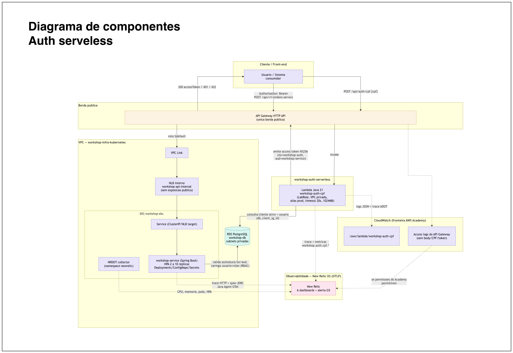

# workshop-auth-serverless

> Autenticacao **serverless por CPF** da **Fase 3** do Tech Challenge (SOAT): uma
> funcao Lambda Java 21 que valida o CPF, confirma a elegibilidade do cliente no RDS e
> emite um **JWT**. Este repositorio tambem provisiona o **API Gateway HTTP**, que e a
> **borda unica** da solucao — roteia `/api/auth/cpf` para a Lambda e todo o restante
> para a aplicacao no EKS via VPC Link.

---

## Proposito

O requisito da Fase 3 e identificar o cliente por CPF antes de permitir o uso da API de
oficina, sem manter um servidor de autenticacao dedicado. A solucao:

1. **Valida o CPF** localmente (formato e digitos verificadores) — CPF invalido nunca
   chega ao banco;
2. **Consulta a elegibilidade** do cliente no RDS PostgreSQL, com a Lambda anexada as
   subnets privadas da VPC;
3. **Emite um JWT** assinado com o segredo compartilhado, no contrato definido pelo
   ADR-004, consumido pela aplicacao no EKS;
4. **Exporta telemetria** (traces, metricas e logs) via OpenTelemetry para o New Relic.

Alem do codigo, o repositorio provisiona a borda: uma unica URL publica atende tanto a
autenticacao quanto a API de negocio, sem expor o cluster diretamente.

### Fronteira

| | |
|---|---|
| **Contem** | Codigo da Lambda, API Gateway HTTP, VPC Link, SGs da Lambda e do link, alias `prod`, log groups |
| **Nao contem** | VPC/EKS (em [workshop-infra-kubernetes](https://github.com/postech-software-architecture/workshop-infra-kubernetes)), RDS (em [workshop-infra-database](https://github.com/postech-software-architecture/workshop-infra-database)) — ambos **lidos** via contrato de outputs |

---

## Tecnologias utilizadas

| Camada | Tecnologia |
|---|---|
| Runtime | **Java 21** em AWS Lambda, empacotado como fat JAR (`maven-shade-plugin` → `function.zip`) |
| Entrada | `aws-lambda-java-core` / `aws-lambda-java-events` (`APIGatewayV2HTTPEvent`) |
| JWT | **JJWT 0.12.6** (`jjwt-api`, `jjwt-impl`, `jjwt-jackson`) |
| Banco | **PostgreSQL** via JDBC (`postgresql` 42.7.4), acesso somente leitura a elegibilidade |
| Serializacao | Jackson Databind 2.18.2 |
| Observabilidade | **OpenTelemetry API** 1.45 + camada **ADOT** (`/opt/otel-instrument`) exportando OTLP `http/protobuf` para o New Relic |
| Testes | JUnit 5.11 + AssertJ 3.27 (`maven-surefire-plugin`) |
| Infraestrutura | **Terraform** (`~> 5.60` AWS provider), backend S3 + lock DynamoDB |
| Borda | **API Gateway HTTP (v2)** + **VPC Link** para o NLB interno do EKS |
| CI/CD | GitHub Actions (`ci.yml`, `cd.yml`, `w0-spikes.yml`) |

---

## Estrutura

```text
src/main/java/com/postech/auth/
├── handler/      → AuthHandler (entrada Lambda, orquestra o fluxo e a telemetria)
├── cpf/          → Documento, ValidadorCpf, TipoDocumento (validacao pura)
├── repository/   → AutenticacaoRepository (consulta de elegibilidade no RDS)
├── token/        → EmissorJwt (emissao do JWT no contrato do ADR-004)
└── telemetry/    → Telemetry (metricas, logs estruturados e correlation id)

infra/            → Terraform da Lambda, API Gateway, VPC Link e SGs
docs/             → openapi-auth.yaml e w0-spikes.md
scripts/spikes/   → preflights manuais da W0 (LabRole, VPC Link/NLB, ingestao OTLP)

.github/
├── workflows/
│   ├── ci.yml        → push e PR: build, testes e pacote; fmt, validate e guard
│   ├── cd.yml        → manual: plan, apply ou destroy
│   ├── _build.yml    → workflow reutilizavel do build, chamado pela CI e pelo CD
│   └── w0-spikes.yml → preflights manuais da W0
└── actions/terraform-backend/
                      → action composta: credencial AWS, pre-voo e terraform init
```

### Roteamento da borda

| Rota | Integracao | Destino |
|---|---|---|
| `POST /api/auth/cpf` | `AWS_PROXY` | Alias `prod` da Lambda de autenticacao |
| `$default` (todas as demais) | `HTTP_PROXY` + VPC Link | NLB interno → aplicacao no EKS |

O stage `prod` tem `auto_deploy`, throttling configuravel (`api_throttling_rate_limit`
e `api_throttling_burst_limit`) e access logs estruturados em JSON no CloudWatch.

---

## Como executar

### Pre-requisitos

**Java 21**, **Maven 3.9+**, **Terraform >= 1.9** (exigido por `infra/versions.tf`; a
pipeline usa 1.9.8) e credenciais temporarias do AWS Academy (incluem
`AWS_SESSION_TOKEN` e expiram em ~4h).

### 1. Build e testes locais

```bash
git clone git@github.com:postech-software-architecture/workshop-auth-serverless.git
cd workshop-auth-serverless

mvn test                      # testes unitarios (validacao de CPF, JWT, handler, telemetria)
mvn package                   # gera target/function.zip (artefato de deploy)
```

O `maven-shade-plugin` empacota o fat JAR diretamente como `target/function.zip`, que e
o `lambda_artifact_path` consumido pelo Terraform.

### 2. Validacao estatica do Terraform (sem credenciais)

```bash
cd infra
terraform fmt -check
terraform init -backend=false
terraform validate
```

### 3. Deploy

O deploy **nao acontece em pull requests**. Ele exige execucao manual: Actions →
**CD — serverless prod** → *Run workflow*, com `action = apply`, Environment `prod` e
a confirmacao literal `APLICAR SERVERLESS PROD`. O mesmo workflow aceita
`action = plan`, que nao exige confirmacao e publica o plano sanitizado como artefato,
e `action = destroy`, que exige `DESTRUIR SERVERLESS PROD`.

O `apply` termina com um smoke test que exige HTTP 422 em `POST /api/auth/cpf` com CPF
invalido. O `destroy` bloqueia a execucao se o plano tocar em qualquer recurso
`aws_eks_*` ou `aws_db_*`, preservando a fronteira entre os repositorios.

**Ordem obrigatoria:** o cluster e o banco precisam existir antes, pois este repositorio
le os outputs de ambos via `terraform_remote_state`.

```text
workshop-infra-kubernetes (apply) → workshop-infra-database (apply) → este repositorio
```

Antes do primeiro deploy, crie no Environment `prod` as *Environment variables*
(nao sao secrets):

| Variavel | Uso |
|---|---|
| `TFSTATE_BUCKET` | Bucket S3 que ja contem `cluster/terraform.tfstate` e `database/terraform.tfstate` |
| `TFSTATE_LOCK_TABLE` | Tabela DynamoDB de lock do Terraform para esse bucket |
| `AWS_REGION` | Regiao do lab; default `us-east-1` |
| `ADOT_LAYER_ARN` | ARN regional da camada ADOT Java compativel com Java 21 |
| `NEW_RELIC_OTLP_ENDPOINT` | Opcional; default `https://otlp.nr-data.net` |

O workflow valida `TFSTATE_BUCKET` e `TFSTATE_LOCK_TABLE` antes do `terraform init`,
configura o backend com elas (chave `serverless/terraform.tfstate`) e tambem as fornece
como buckets de state do cluster e do banco.

E os *secrets*, tambem no Environment `prod`. O nome do secret nao e o nome da variavel
Terraform: o workflow faz o mapeamento.

| Secret | Variavel Terraform | Uso |
|---|---|---|
| `AWS_ACCESS_KEY_ID`, `AWS_SECRET_ACCESS_KEY`, `AWS_SESSION_TOKEN` | — | Credenciais Academy |
| `DB_PASSWORD` | `db_password` | Senha do RDS — a **mesma** consumida pelo k8s Secret |
| `JWT_SECRET` | `jwt_secret` | Segredo de assinatura do JWT, compartilhado com a aplicacao |
| `NEW_RELIC_LICENSE_KEY` | `new_relic_api_key` | Chave de ingestao do New Relic |

`service_version` nao e configuravel: a pipeline injeta o SHA do commit em execucao.

Nunca commite `.tfvars` com segredos — o arquivo esta no `.gitignore`. Para rodar o
Terraform localmente, copie
[`infra/terraform.tfvars.example`](infra/terraform.tfvars.example) para
`infra/terraform.tfvars` e preencha. Detalhes de observabilidade em
[`infra/README.md`](infra/README.md).

#### Credencial do AWS Academy expirada

A sessao do lab dura cerca de quatro horas. Quando expira, o `terraform init` falha com
um `HeadObject 403 Forbidden` do S3 que nao menciona credencial nenhuma. O pre-voo da
action composta separa os casos — sessao invalida, state ainda inexistente e acesso
negado — e diz o que fazer. Para renovar: abra o lab, copie o bloco *AWS CLI* e
atualize os tres secrets `AWS_*` do Environment.

### 4. Execucao manual local (opcional)

```bash
cd infra
export AWS_ACCESS_KEY_ID=... AWS_SECRET_ACCESS_KEY=... AWS_SESSION_TOKEN=...
export TF_VAR_db_password='...' TF_VAR_jwt_secret='...' TF_VAR_adot_layer_arn='...'
export TF_VAR_new_relic_api_key='...' TF_VAR_service_version="$(git rev-parse HEAD)"

terraform init && terraform plan
terraform apply
terraform output api_gateway_url
```

### 5. Validacao pos-deploy

```bash
API_URL=$(terraform output -raw api_gateway_url)

# CPF elegivel -> 200 com JWT
curl -X POST "$API_URL/api/auth/cpf" \
  -H 'Content-Type: application/json' \
  -d '{"cpf":"123.456.789-09"}'

# CPF invalido -> 422
curl -X POST "$API_URL/api/auth/cpf" \
  -H 'Content-Type: application/json' \
  -d '{"cpf":"111.111.111-11"}'
```

### Preflights da W0

Os preflights executaveis dos riscos da W0 estao em
[`docs/w0-spikes.md`](docs/w0-spikes.md). Sao acionados manualmente
(`w0-spikes.yml`), usam recursos temporarios e **nao** fazem parte da CI comum.

---

## Diagrama da arquitetura



> Fonte editavel: [`docs/diagrama/diagrama_componentes_auth_serverless.drawio`](docs/diagrama/diagrama_componentes_auth_serverless.drawio)

---

## API — Swagger / Postman

Especificacao OpenAPI 3.0: [`docs/openapi-auth.yaml`](docs/openapi-auth.yaml)

### `POST /api/auth/cpf`

**Request**

```json
{ "cpf": "123.456.789-09" }
```

**Respostas**

| Status | Significado |
|---|---|
| `200` | JWT emitido |
| `401` | Cliente nao elegivel |
| `422` | CPF invalido (formato ou digitos verificadores) |
| `500` | Erro interno |
| `503` | Banco de dados indisponivel |

Para visualizar em Swagger UI, cole o conteudo de `docs/openapi-auth.yaml` no
[Swagger Editor](https://editor.swagger.io/). O arquivo tambem pode ser importado
diretamente no Postman (*Import → File → OpenAPI 3.0*).

<!-- TODO: adicionar link da collection Postman publicada, se houver. -->

---

## Agentes

Ver [.claude/agents/README.md](.claude/agents/README.md).
